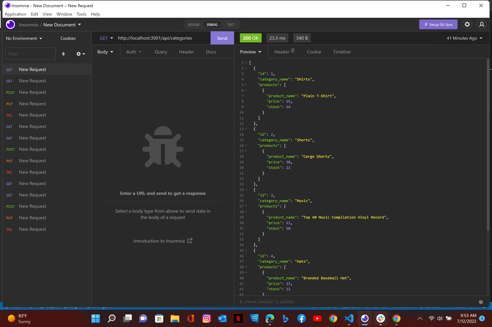

  # ecommerce-backend

  * 
  
  ## License 

   * Licensed by [ISC License](https://choosealicense.com/licenses/isc/)

  ## Link to video

  -[demonstration-video-->](https://drive.google.com/file/d/1etDNhbZ3j1-vGLgCRnaFajXjzI99rwDy/view)

  ## Link to Repository

  -[repository-->](https://github.com/Codechef27/ecommerce-backend)

  ## Table of Contents

  - [Description](#description)
  - [Installation](#install-instructions)
  - [Languages](#languages-used)
  - [Usage](#usage)
  - [Contribution](#contributing)
  - [Test](#test)
  - [Questions](#questions)

  ## Description

  I developed a database for a ecommerce site.

  ## Languages Used
  
  javascript, node.js, node packages
  

  ## Usage 

  Ecommerce is used to add, update and delete data from the database.

  ## Install Instructions

  Clone the repo, run npm i to install all the packages, navigate to your terminal and run npm start to open the server.  

  ## Tests

  tested get, put, post and delete routes with insomnia.

  ## Contributing

  Bradley J kennett

  ## Questions

  Contact Me!

  * Github Account:  [Codechef27](https://github.com/Codechef27)
  * Email Me:  bradleyjkennett@gmail.com

  ## Screenshot

  
